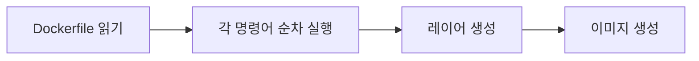

- 오늘은 총학 회의 준비 하다가 스터디 진행할듯

> [!faq] Docker를 왜 써야하는가?
> - 환경 일관성
> - 빠른 온보딩
> - 쉬운 배포
> - 롤백 용이

> [!info] Image
> 컨테이너를 만들기 위한 읽기 전용 템플릿
> > [!abstract] 특징
> > - 읽기 전용 - 한번 생성되면 변경 불가
> > - 레이어 구조 - 여러 층으로 구성되어 효율적 저장
> > - 재사용 가능 - 같은 이미지로 여러 컨테이너 생성
> > ```mermaid
> > graph TD
> > Layer4:AppCode --> Layer3:pip --> Layer2:Python3.11 --> Layer1:Ubuntu
> > ```

> [!info] Container
> 이미지의 실행 인스턴스 (실제 동작하는 프로세스)
> > [!abstract] 특징
> > - 읽기/쓰기 가능 - 실행 중 변경 가능
> > - 격리된 환경 - 독립적인 파일 시스템과 네트워크
> > - 휘발성 - 삭제하면 변경사항 사라짐
> > ```mermaid
> > graph LR
> > Create --> Start --> Running
> > Stop --> Remove
> > Stop --> Start
> > Running --> Stop
> > ```
> > ==하나의 이미지로 여러 컨테이너 생성 가능==
> 
> 다시 말해 애플리케이션과 그 실행에 필요한 모든 의존성을 하나의 패키지로 묶어 격리된 환경에서 실행하는 기술
> > [!abstract] 특징
> > - 호스트 OS 커널을 공유 (가벼움)
> > - 프로세스 수준의 격리
> > - 빠른 시작/종료 (초 단위)
> 
> ```mermaid
> block-beta
> columns 1
>  block:ID
>    Container1
>    Container2
>    Container3
>  end
>  DockerEngine
>  HostOS
>  Hardware
> ```

> [!info] Registry
> Docker 이미지를 저장하고 배포하는 저장소
> > [!abstract] 예시
> > - nginx
> > - postgres
> > - python
> > - node
> > - redis
> 
> ```mermaid
> graph TD
> DockerHub -- pull --> LocalMachine -- push --> DockerHub
> ```

> [!tip] VM vs Container
> # VM
> GuestOS
> Hypervisor
> # Container
> DockerEngine
> HostOS (share)

> [!info] Dockerfile
> 도커 이미지를 만들기 위한 설정 파일
> > [!abstract] 특징
> > - 텍스트 파일 (확장자 없음)
> > - 순차적 명령어 실행
> > - 버전 관리 가능 (Git)
> 
> ```dockerfile
> # 베이스 이미지 지정
> FROM python:3.11 -slim
> # 작업 디렉토리 설정
> WORKDIR /app
> # 의존성 파일 복사
> COPY requirements.txt .
> # 의존성 설치
> RUN pip install -r requirements.txt
> # 소스코드 복사
> COPY . .
> # 포트 노출
> EXPOSE 8000
> # 실행 명령
> CMD ["uvicorn", "main:app", "--host", "0.0.0.0"]
> ```
> - `FROM`: 베이스 이미지
>    - 자주 사용하는 베이스 이미지
>       - `python:3.11-slim`, `node:20-alpine`, `ubuntu:22.04`, `alpine:3.18`
>       - `alpine`과 `slim` 태그는 경량화된 이미지로 빌드 속도와 크기에 유리
> - `WORKDIR`: 작업 디렉토리
> - `COPY`: 파일 복사
>    - 파일 또는 디렉토리를 복사하는 기능
>    - `copy . .`을 활용하면 현재 디렉토리 전체를 복사함
> - `RUN`: 빌드 시 실행
>    - 이미지 빌드 시 실행되는 명령어
>    - 용도
>       - 패키지 설치, 파일 생성/수정, 설정 작업
> - `CMD`: 컨테이너 시작 시
>    - 컨테이너 시작 시 실행
>    - 용도
>       - 서버 실행
>       - 앱 시작
>       - 기본 명령어

도커 사용법으로 넘어가보면
이미지 빌드
```cmd
docker build -t my-app:v1 .
```
`-t`: 이미지 이름과 버전 태그 지정
`.`: Dockerfile 위치
빌드 과정

==레이어는 캐시되어 변경되지 않은 부분은 재사용 빌드 속도 향상==

이미지 다운로드
```cmd
docker run -d -p 8080:80 --name my-nginx nginx
```
`-d`: 백그라운드 실행
`-p`: 포트 매핑 (호스트:컨테이너)
`--name`: 컨테이너 이름 지정
`nginx`: 사용할 이미지 이름
`-e`: 환경변수 설정
`-v`: 볼륨 마운트
`-rm`: 종료 시 자동 삭제

실행 중인 컨테이너 확인
```cmd
docker ps
```
`CONTAINER ID`: 고유 식별자
`STATUS`: 컨테이너 상태
`PORTS`: 포트 매핑 정보
`NAMES`: 컨테이너 이름

기본 로그 확인
```cmd
docker logs my-nginx
```
`-f`: 실시간 확인 (follow)

컨테이너 내부 쉘 접속
```cmd
docker exec -it my-nginx /bin/bash
```
`-i`: 표준 입력 유지
`-t`: 가상 터미널 할당
`/bin/bash`: `bash shell` 열기 - 다른 명령어도 실행 가능

컨테이너 중지
```cmd
docker stop my-nginx
```

컨테이너 삭제
```cmd
docker rm my-nginx
```
`-f`: 강제 옵션
==컨테이너를 삭제해도 이미지는 남아있음==

이미지 삭제
```cmd
docker rmi my-nginx
```

> [!info] Docker Compose
> 여러개의 `Docker Container`를 한번에 관리할 수 있도록 도와주는 기능
> - 한 줄로 모든 서비스를 시작할 수 있음
> - 설정 파일로 버전 관리
> - 의존성 자동 처리
> `docker-compose.yml` 파일로 만들어야 함
> ```yaml
> version: "3.8 "
> services:
>    frontend:
>       build:
>          context: ./frontend
>          dockerfile: Dockerfile
>       ports: "3000:3000"
>       volumes: ./frontend/src:/app/src
>       depends_on: backend
>    backend:
>       build: ./backend
>       ports: "8000:8000"
>       environment:
>          DATABASE_URL=postgresql://user.pass@db:5432/kmap
>       depends_on: db
>    db:
>       image: postgres:15
>       environment:
>          POSTGRES_USER=user
>          POSTGRES_PASSWORD=pass
>          POSTGRES_DB=kmap
>       volumes: db_data:/var/lib/postgresql/data
> ```
> `services`: 컨테이너 정의
> `build / image`: 빌드 경로 또는 이미지
> `ports`: 포트 매핑
> `depends_on`: 의존성 (시작 순서)
> `volumes`: 데이터 영속화;소스 변경 시 실시간 반영 (개발용)
> `environment`: 환경 변수 설정
> ==db:5432 - 서비스명으로 통신 (따로 공부해볼만한 주제)==

Docker Compose 명령어 모음
시작
```cmd
docker compose up -d
```
`-d`: 백그라운드 실행
`--build`: 이미지 재빌드 요청

로그 확인
```cmd
docker compose logs -f
```

중지 및 삭제
```cmd
docker compose down
```

상태 확인
```cmd
docker compose ps
```

재시작 (특정 서비스만)
```cmd
docker compose restart backend
```

> [!example] 개발 시나리오
> # 1번 시나리오
> ```mermaid
> graph LR
> 1["코드 수정"] -->
> 2["이미지 빌드"] -->
> 3["컨테이너 실행"] -->
> 4["커밋 & 푸시 (Git)"]
> ```
> 무조건 빌드해서 새로 생성해야 컨테이너에 코드 변경사항이 적용됨
> # 2번 시나리오
> ```mermaid
> graph LR
> 1["코드 수정"] -->
> 2["자동 반영"] -->
> 3["브라우저 확인"] -->
> 4["커밋 & 푸시 (Git)"]
> ```
> 컨테이너 재시작 없이 실시간 개발 가능
> `but`, 회원가입/로그인 기능이 구현된 백엔드의 경우 토큰 값이 리셋되므로 1번 방식을 따라야 함

### 오늘의 메모
---
막상 스터디를 해보니 재미있고 그렇게 어렵지 않아서 해볼만 한 것 같음
앞으로도 그냥 재미있게 할 수 있을 것 같음 :)

퇴근 18:00