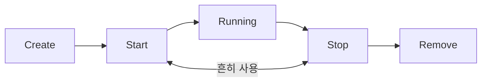
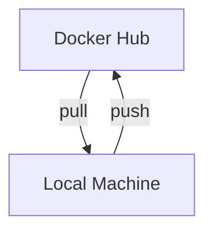

0113

---
> [!faq] Docker의 장점?
> -> 완전한 오픈소스/ 경량화/ 장기적인 보안/ 보안 취약점 감소/ 쉬운 커스터마이징 / 1000개 이상의 공식 사례

> [!faq] Docker를 사용해야 하는 이유?
> -> 환경 일관적 / 빠른 온보딩 / 쉬운 배포 / 롤백 용이

---
# ==Image==
### ** Image(이미지)란? **
-> 컨테이너를 만들기 위한 읽기 전용 템플릿
### **Image(이미지)의 특징**
1. 읽기 전용 구조 - 한 번 생성되면 변경 불가
2. 레이어 구조 - 여러 층으로 구성되어 효율적인 저장
3. 재사용 가능 - 같은 이미지로 여러 컨테이너 생성
---
# ==Container==
### ** Container(컨테이너)란? **
-> 이미지의 실행 인스턴스(실제 동작하는 프로세스)
### **Container(컨테이너)의 특징**
1. 읽기/쓰기 가능 - 실행 중 변경 가능
2. 격리된 환경 - 독립적인 파일 시스템과 네트워크
3. 휘발성 - 삭제하면 변경사항 사라짐

*하나의 이미지로 여러 컨테이너 생성 가능*

>[!note] 핵심 정의
>애플리케이션과 그 실행에 필요한 **모든 의존성**을 하나의 패키지로 묶어 **격리된 환경에서 실행**하는 기술
> >[!abstract] 특징
> > - 호스트 OS 커널을 공유 (가벼움)
> > - 프로세스 수준의 격리
> > - 빠른 시작/종료 (초 단위)

>[!important] Container 구조
>> ``` mermaid
>> block-beta
>> columns 1
>> block:ID
>> 	Container1
>> 	Container2
>> 	Container3
>> end
>> DockerEngine
>> HostOS
>> Hardware
>> ```

> [!danger] ## Virtual Machine VS Container
> | 구분 | Virtual Machine (VM) | Container |
>|---|---|---|
>| 가상화 수준 | 하드웨어 수준 가상화 | OS 수준 가상화 |
>| 커널 | 각 VM마다 독립적인 커널 | 호스트 OS 커널 공유 |
>| OS 포함 여부 | Guest OS 포함 | OS 미포함 |
>| 실행 단위 | VM 단위 | 프로세스 단위 |
>| 시작 시간 | 느림 (수십 초 ~ 분) | 매우 빠름 (초 단위) |
>| 리소스 사용 | 무거움 | 가벼움 |
>| 격리 수준 | 매우 강함 | 상대적으로 약함 |
>| 대표 기술 | VMware, VirtualBox, Hyper-V | Docker, Podman | 
> ---
>## ==Virtual Machine==
>>[!info] Virtual Machine (VM)
>>**하드웨어를 가상화하여 독립적인 컴퓨터를 만드는 기술**
> 
>>[!abstract] 특징
> >- 하이퍼바이저(Hypervisor) 위에서 동작
> >- Guest OS를 포함
>> - 완전한 OS 환경 제공
> >- 서로 다른 OS 실행 가능 (Linux 위에 Windows 등)
> 
>> [!example] 장점
> >- 강력한 격리 (보안 ↑)
> >- OS 단위 테스트에 적합
> 
> >[!warning] 단점
> >- 리소스 소모 큼
> >- 부팅/종료 느림
> ---
> ## ==Container==
> >[!info] Container
> >**호스트 OS 커널을 공유하며 애플리케이션을 격리 실행하는 기술**
> 
> >[!abstract] 특징
> >- OS 커널 공유
> >- 애플리케이션 + 라이브러리만 포함
> >- 프로세스 수준 격리
> >- 이미지 기반 배포
> 
> >[!example] 장점
> >- 매우 빠른 실행
> >- 리소스 효율적
> >- 배포 및 확장 용이
> 
> >[!warning] 단점
> >- 커널 공유로 보안 격리 한계
> >- 다른 OS 커널 사용 불가
> 
> ---
> > VM은 **OS까지 포함한 가상 컴퓨터**,  
> >Container는 **OS 위에서 실행되는 가벼운 실행 환경**
---
# ==Registry==
### ** Registry(레지스트리)란? **
-> Docker 이미지를 저장하고 배포하는 저장소

**Docker Hub 공식 이미지 예시**
: nginx, postgres, python, node, redis

---
# ==DockerFile==
### ** DockerFile이란? **
-> 도커 이미지를 만들기 위한 설정 파일
>[!abstract] 특징
> - 호스트 OS 커널을 공유 (가벼움)
> - 프로세스 수준의 격리
> - 빠른 시작/종료 (초 단위)
> ```mermaid
> flowchart LR
> Dockerfile[Dockerfile] --> |docker build|DockerImage[Docker Image]

>[!info] Dockerfile 예시 (FastAPI 프로젝트용)
>```Dockerfile
>#베이스 이미지 지정
>FROM python:3.11-slim
>#작업 디렉토리 설정
>WORKDIR /app
>#의존성 파일 복사
>COPY requirements.txt .
>#의존성 설치
>RUN pip install -r requirements.txt
>#소스코드 복사
>COPY . .
>#포트 노출
>EXPOSE 8000
>#실행 명령
>CMP["uvicorn", main:app","--host","0.0.0.0"]
>```
>>[!abstract] 핵심 명령어
>>- ==**FROM 베이스 이미지**==
>>-> 모든 Dockerfile은 FROM으로 시작
>>- 자주 시용하는 베이스 이미지
>>: Python [python:3.11-slim] / Node.js [node:20-alpine] / Ubuntu [ubuntu:22.04] / Alpine [alpine:3.18]
>>	- *slim과 alpine 태그는 경량화된 이미지로 빌드 속도와 크기에 유리*
>>- ==**WORKDIR**==
>>-> 작업 디렉토리 설정. 이후 명령어들은 이 경로를 기준으로 실행
>> ```dockerfile
>>WORKDIR /app
>>```
>>- ==**COPY**==
>>-> 호스트 파일을 컨테이너로 복사 (소스 대상)
>>>[!info] COPY 패턴 예시
>>>```dockerfile
>>>#특정 파일만 복사
>>>COPY requirements.txt .
>>>#디렉토리 복사
>>>COPY scr/ /app/src/
>>>#현재 디렉토리 전체 복사
>>>COPY . .
>>>```
>>
>>*WORKDIR/COPY - .dockerignore로 제외할 파일 지정 가능*
>>-  ==**RUN**==
>>	- 용도
>>		 1. 패키지 설치
>>		2. 파일 생성/수정
>>		3. 설정 작업
>>	- 실행 시점 : 이미지 빌드 시 실행
>>	```dockerfile
>>	RUN pip install -r requirements.txt
>>	```
>>-  ==**CMD**==
>>	- 용도
>>		1. 서버 실행
>>		2. 앱 시작
>>		3. 기본 명령어
>>	- 실행 시점 : 컨테이너 시작 시 실행
>>	```dockerfile
>>	CMD ["uvicorn","main:app"]
>>	```
---

# ==Docker 사용법==
### 1. 이미지 빌드 : docker build
```cmd
docker build -t my-app:v1
```
`-t my-app:v1` : 이미지 이름과 태그 지정
`. (마침표)` : 빌드 컨텍스트 (Dockerfile 위치)
- 빌드 과정

*레이어는 캐시되어 변경되지 않은 부분은 재사용 빌드 속도 향상*
>[!absctract] 이미지 관련 명령어
>- **이미지 다운로드**
>```cmd
>docker pull nginx
>```
>: Docker Hub에서 nginx 이미지를 로컬로 다운로드
>- **이미지 목록 확인**
>```cmd
>docker images
>```
>: 로컬에 저장된 모든 이미지 목록 표시
>- **이미지 삭제**
>```cmd
>docker rmi nginx
>```
>: 지정한 이미지를 로컬에서 삭제

### 2. 컨테이너 실행 : docker run
```cmd
docker run -d -p 8080:80 --name my-nginx nginx
```
`-d` : 백그라운드 실행 (detached mode)
`-p 8080:80` : 포트 매핑 (호스트:컨테이너)
`--name` : 컨테이너 이름 지정
`nginx` : 사용할 이미지 이름
- **자주 쓰는 옵션들**
`-e` : 환경변수 설정
`-v` : 볼륨 마운트
`--rm` :종료 시 자동 삭제
### 3. 컨테이너 상태 확인 : docker ps
```cmd
#실행중인 컨테이너 확인
docker ps
```
```cmd
#출력 결과 해석
a1b2c3d4e5f6 nginx "/docker-entrypoint..." Up 2 minutes 0.0.0.0:8080->80/tcp my-nginx
```
- CONTAINER ID : 고유 식별자 -> a1b2c3d4e5f6
- IMAGE -> nginx
- COMMAND -> "/docker-entrypoint..."
- STATUS : 컨테이너 상태 -> Up 2 minutes
- PORTS : 포트 매핑 정보 -> 0.0.0.0:8080->80/tcp
- NAMES : 컨테이너 이름 -> my-nginx

### 4. 로그 확인
- **기본 로그 확인**
```cmd
docker logs my-nginx
```
: 컨테이너의 stdout/stderr 출력 확인
- **실시간 로그 확인 (follow)**
```cmd
docker logs -f a1b2c3d4e5f6
```
: 실시간으로 로그 스트리밍 (Ctrl+C로 종료)

### 4. 컨테이너 접속 : docker exec
- ** 컨테이너 내부 쉘 접속**
```cmd
  docker exec -it my-nginx /bin/bash
```

  `-i (interactive)` : 표준 입력 유지
  `-t (tty)` : 가상 터미널 할당
  `/bin/bash` : 실행할 명령어
  
>[!info] 활용 예시
>```cmd
>#컨테이너 내부에서 파일 확인
>ls -la /etc/nginx/
>
>#설정 파일 확인
>cat /etc/nginx/nginx.conf

### 5. 컨테이너 중지 및 삭제
- **컨테이너 중지 (Graceful shutdown / SIGTERM)**
```cmd
docker stop my-nginx
```
- **컨테이너 삭제**
```cmd
docker rm my-nginx
```
  : 중지된 컨테이너만 삭제 가능
- **강제 삭제 (실행 중이어도)**
```cmd 
docker rm -f my-nginx
```
- **이미지 삭제**
```cmd
docker rmi my-nginx
```
*TIP : 컨테이너를 삭제해도 이미지는 남아있다.*
>[!abstract] 명령어 모음 
>- **이미지**
>```cmd
>docker pull [이미지]
>docker images
>docker rmi [이미지]
>docker build -t [태그] .
>```
>- **컨테이너 실행**
>```cmd
>docker run -d -p [H:C] [이미지]
>docker ps /  docker ps -a
>docker stop [컨테이너]
>docker rm [컨테이너]
>```
>- **디버깅**
>```cmd
>docker logs -f [컨테이너]
>docker exec -it [컨테이너] bash
>docker inspect [컨테이너]
>docker stats
>```

--- 
# ==Docker Compose==
**Docker Compose는 여러 컨테이너로 구성된 애플리케이션을 하나의 설정 파일로 정의하고 한 번에 실행·관리하기 위해 사용**
- 한 줄로 모든 서비스 시작
- 설정 파일로 버전 관리
- 의존성 자동 처리
-> docker-compose.yml로 만들어서 사용
>[!info] docker-compose.yml 예시
>```yml
>version: "3.8"
>services:
>	frontend:
>		build: ./frontend
>		ports: "3000:3000"
>	backend:
>		build: ./backend
>		ports: "8000:8000"
>		depends_on: db
>	db:
>		image: postgres: 15
>		volumes: db_data:/var/lib/postgresql/data
>```
>>[!abstract] 주요 키워드
>>- services : 컨테이너 정의
>>- build / image : 빌드 경로 또는 이미지
>>- ports : 포트 매핑
>>- depends_on : 의존성 (시작 순서)
>>- volumes : 데이터 영속화
### ==KMAP Compose 파일 분석==
```yml
version: "3.8"
services:
	frontend:
		build: 
			context: ./frontend
			dockerfile: Dockerfile
		ports: "3000:3000"
		volumes: ./frontend/src:/app/src
		depends_on: backend
	backend:
		build: ./backend
		ports: "8000:8000"
			environment: 
				DATABASE_URL=postgresql://user.pass@db:5432/kmap
			depends_on: [db]
	db:
		image: postgres: 15
		environment:
			POSTGRES_USER=user
			POSTGRES_PASSWORD=pass
			POSTGRES_DB=kmap
		volumes: db_data:/var/lib/postgresql
```
#### 1. Frontend  분석
- 설정 설명
`build` : ./frontend 폴더의 Dockerfile로 빌드
`ports: "3000:3000"` : 호스트 3000 컨테이너 3000
`volumes (개발용)` : 소스 변경 시 실시간 반영 (Hot Reload)
`depends_on` : backend가 먼저 시작된 후 실행
#### 2. Backend  분석
- 주요 포인트
`environment` : 환경변수로 설정 주입
`image (vs build)` : 공식 이미지 직접 사용
`volumes (Named)` : DB 데이터 영속화

#### -> ==*db:5432 - 서비스명으로 통신*==
-> Docker Compose에서는 컨테이너의 IP가 아닌 서비스명을 DNS 이름처럼 사용해 안정적으로 통신하기 위해
#### -> WHY 서비스명으로 통신?
1. **컨테이너 IP는 매번 바뀜**
	- 컨테이너 재시작 시 IP가 변경됨
	- IP에 의존하면 연결이 깨지게 됨
-> but. **서비스명은 고정 이름**이라 안전
2. **Docker Compose가 내부 DNS 제공**
	- 한 docker-compose.yml 안의 서비스들은 자동으로 가상 네트워크에 연결됨
	- 서비스명 = 호스트명
3. **환경 분리 & 이식성**
	- 로컬/ 서버/ CI 환경에서도 설정 변경 없이 동일하게 동작
4. **역할 중심 설계**
	- IP보다 의도가 잘 드러남
	- 협업·유지보수에 유리함
>[!abstract] Docker Compose 명령어 모음 
>- **시작** : 모든 서비스 백그라운드 시작
>```cmd
>docker compose up -d
>```
>- **로그 확인** :모든 서비스 로그 실시간 확인
>```cmd
>docker compose logs -f
>```
>- **재빌드** : 이미지 재빌드 후 시작
>```cmd
>docker compose up -d --build
>```
>- **종료** : 모든 서비스 중지 및 삭제
>```cmd
>docker compose down
>```
>- **상태 확인** : 서비스별 상태 확인
>```cmd
>docker compose ps
>```
>- **특정 서비스만** : 특정 서비스만 재시작
>```cmd
>docker compose restart backend
>```

--- 
# ==Docker Compose 개발 시나리오==
>[!example] Docker Compose 개발 시나리오 1
>```mermaid
>flowchart LR
>	code[1.코드 수정] --> image[2.이미지 빌드] --> container[3.컨테이너 실행] --> git[4.커밋&푸시]
>```
>- 코드 수정 : IDE에서 편집
>- 이미지 빌드 : Dockerfile을 기반으로 빌드
>- 컨테이너 실행  : 명령어로 컨테이너 실행해서 변경사항 확인
>- 커밋&푸시 : Git
>==*Docker 이미지는 수정 불가능하기 때문에 **무조건 빌드해서 새로 생성**해야 컨테이너에 코드 변경사항 적용됨*==

>[!example] Docker Compose 개발 시나리오 2
>```mermaid
>flowchart LR
>	code[1.코드 수정] --> volume[2.자동 반영] --> browser[3.브라우저 확인] --> git[4.커밋&푸시]
>```
>- 코드 수정 : IDE에서 편집
>- 자동 반영 : Volume 마운트
>- 브라우저 확인 : Hot Reload
>- 커밋&푸시 : Git
>==*Docker Compose + Volume 마운트로 **컨테이너 재시작 없이** 실시간 개발 가능*==
>-> but, 로그인&회원가입 기능 backend 작업에서는 사용하지 x