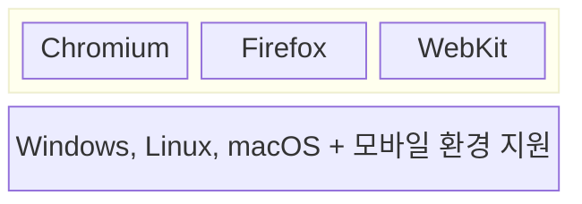
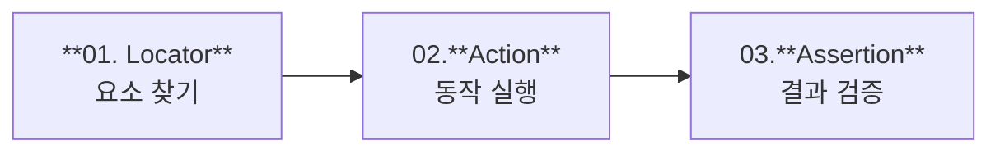
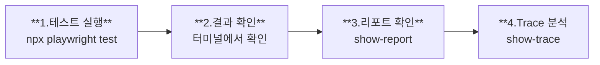

**"코드 한 줄 수정했는데 서비스가 터졌다"** -> *수동 테스트만으로는 모든 케이스 커버 불가능*
>[!warning] 문제점
>- 코드 수정 할 때마다 전체 수동 테스트
>- Chrome에서는 됐는데 Safari에서는 안 됨
>> [!abstract] 해결책
>> E2E 테스트 도구인 Playwright을 이용해 이 과정을 코드로 자동화

--- 
# ==Test==
### ** 1. Test의 장점 **
1. **검증 보장** - 리펙토링, 기능 추가 시 기존 기능을 깨뜨리지 않음을 보장
2. **문서화** - 테스트 코드가 기능 명세서 역할
3. **협업 효율** - PR 리뷰 시 검증된 코드 제출

### ** 2. Test 피라미드 **

![[Pasted image 20260127110805.png|350]]  
-> **위로 갈수록** - 신뢰도 높음 / 유지비용 높음 / 속도 느림
-> **아래로 갈수록** - 비용 낮음 / 속도 빠름 / 작성 용이
: **효율적인 전략 : 하위 단게에 집중, E2E는 핵심만**
---
# ==Test 피라미드==
#### ** 1. Unit Test (단위 테스트) **
>[!info] 정의
>: 함수나 클래스 같은 코드의 최소 단위를 독집적으로 검증
>>[!example] 특징
>>1. 빠른 속도
>>2. 낮은 작성 비용
>>3. Mock/Stub으로 외부 의존성 격리
>
>도구 : Jest, Vitest, JUnit

#### ** 2. Integration Test (통합 테스트) **
>[!info] 정의
>: 여러 모듈이나 컴포넌트가 함께 잘 동작하는지 검증
>>[!example] 특징
>>1. 외부 의존성(DB, API) 포함
>>2. 단위 테스트보다 느리지만 신뢰도 높음
>>3. 시스템 결합부의 문제 조기 발견
>
>도구 : Jest, Mocha, Supertest

#### ** 3. End-to-End Test (E2E 테스트) **
>[!info] 정의
>: 실제 사용자 시나리오를 시뮬레이션하여 시스템 전체가 올바르게 동작하는지 검증
>>[!example] 특징
>>1. 실제 브라우저 환경에서 테스트
>>2. 프론트 + 백엔드 + DB 모두 검증
>>3. 가장 높은 신뢰도
>
>도구 : Playwright, Cypress, Selenium
>>[!abstract] 왜 E2E 테스트를 사용하는가?
>>**1. 실제 사용자 경험 검증**
>>- 사용자 관점에서 전체 흐름 테스트
>>
>>**2. 크로스 브라우징 이슈 방지** 
>>- Chrome, Safari, Firefox 등 다양한 환경
>>
>>**3. 배포 전 최종 테스트**
>>- CI/CD 파이프라인에서 자동 검증
>>
>>**핵심 전략**
>>**==핵심 시나리오만 최소화해서 접근==**
>>- 로그인/회원가입
>>- 주요 기능
>>- 핵심 사용자 플로우

---
# ==Playwright==
**브라우저 자동화 프레임워크**
- 웹 테스트 및 자동화를 위한 오픈소스 라이브러리

## 1. 작동 원리
- 브라우저 컨텍스트란 ?
-> 브라우저의 **시크릿 모드(Incognito)**와 유사한 격리된 환경
>[!abstract] 격리되는 것들
>- 쿠키 (Cookies)
>- 로컬 스토리지 (localStorage)
>- 세션 스토리지 (sessionStorage)
>- 캐시 (Cache)
>생성 속도 : 새 컨텍스트 생성 = **밀리초 단위** (거의 오버헤드 없음)
>병렬 실행 시에도 안전
## 2. 프로젝트 구조
```
tests/
```
테스트 파일들이 위치. *.spec.ts패턴
```
playwright.config.ts
```
브라우저, 타임아웃, 리포터 등 설정
```
test-results/
```
테스트 결과, 스크린샷, 비디오 저장
## 3. Spec, Fixture
#### Spec (Specification)
**"무엇을 테스트할 것인가?"**
- 테스트 시나리오와 검증 로직
- .spec.ts 파일에 작성
- test() 함수로 케이스 정의
#### Fixture
**"어떤 환경에서 실행할 것인가?"**
- 테스트 실행 환경 제공
- 자동 설정(Setup) 및 정리 (Teardown)
- 테스트 간 완전 격리 보장

-> 핵심 포인트 : Playwright가 (page)를 자동으로 생성하고 주입해줍니다. 
테스트 끝나면 자동 정리!
## 4. Page Object Model (POM)
>[!note] POM이란?
>웹페이지를 **클래스(Class)**로 정의하여 테스트 코드와 UI 조작을 분리하는 디자인 패턴
>>[!info] 역할 분리
>>```mermaid
>>graph LR
>>spec["**Spec 테스트** 
>>무엇을 검증"] --> page["**Page Object**
>>어떻게 조작"]
>>```
>
>>[!example] POM의 3가지 장점
>>**1. 유지보수 용이**
>>UI 변경 시 Page 클래스만 수정
>>**2. 코드 재사용**
>>로그인 등 공통 동작을 여러 테스트에서 사용
>>**3. 가독성 향상**
>>loginPage.clickLogin() vs page.locator(...)
>
>### POM + Fixture
>**Fixture 결합 (심화)**
>test.extend()로 loginPage를 Fixture로 등록하면 매번 새로할 필요 없이 자동 주입 가능

## 5. 테스트 구조
```playwright
//login.spec.ts
import { test, expect } from '@playwright/test';

test.describe('로그인 기능', () => {
test.beforeEach(async ({page}) => {
await page.goto('/login');
});

test('성공 케이스', async ({ page }) => {
//테스트 로직
});
});
```
`test.describe()` : 관련 테스트를 그룹화
`test.beforeEach()` : 각 테스트 전 실행되는 설정
`test()` : 개별 테스트 케이스 정의
`{page}` : Playwright가 제공하는 Fixture

---
# ==Playwright 기초 문법==
# ==Locator==

요소를 찾고 -> 동작을 실행하고 -> 결과를 검증한다
## 01. Locator - 요소 찾기 (1)
```
//page.locator() - CSS 선택자
await page.locator('button').click();
await page.locator('.btn').click();
```

```
//page.getByRole() - ARIA role
await page.getByRole('button',
{ name: '로그인' }).click();
```

```
//page.getByTestId() - data-testid
await page.getByTestId('submit')
.click();
```
>[!example] Locator 선택 우선순위
>- getByRole - 접근성 기반 (권장)
>- getByTestId - 테스트 전용 ID
>- getByText - 텍스트 기반
>- getByPlaceholder - placeholder
>- locator - CSS (최후 수단)
>==CSS 클래스보다 역할(role)이나 텍스트 기반이 더 안정적이다.==

**//page.getByText() - 텍스트 기반**
```
await page.getByTest('환영합니다')
.isVisible();
//exat: true로 정확 매칭
```
**//page.getByLabel() - label 기반**
```
await page.getByLabel('비밀번호')
.fill('mypassword');
```
**//page.getByPlaceholder()**
```
await page
.getByPlaceholder('이메일 입력')
.fill('test@test.com');
```
**//page.getByAltText() - alt 속성**
```
await page
.getByAltText('프로필 이미지')
.click();
```

## 02. Locator - 필터링과 체이닝
**//locator.filter() - 조건부 필터링**
```
await page.locator('li')
.filter({ hasText: '완료됨' })
.click();
```
**//인덱스로 선택**
```
await page.locator('li').first();
await page.locator('li').last();
await page.locator('li').nth(2);
```
>[!info] **체이닝 패턴**
>Locator 메서드들은 체이닝이 가능합니다.
>//체이닝 예시
>```
>await page
>.getByRole('list')
>.filter({ hasText: '할 일' })
>.getByRole('button')
>.click();
>```

# ==Action==
## 03. Action - 동작 실행
**//click() - 클릭**
```
await page.getByRole('button').click;
```
**//fill() - 입력 (기존 값 삭제 후)**
```
await page.getByPlaceholder('이메일')
.fill('test@tst.com');
```**//fill() - 입력 (기존 값 삭제 후)**
```
**//type() - 타이핑 (한 글자씩)**
```
await page.locator('input')
.type('Hello', { delay: 100 });
```
**//press() - 키보드 입력**
```
await page.keybord.press('Enter');
await page.keybord.press('Tab');
```
**//hover() - 마우스 호버**
```
await page.locator('.menu').hover();
```
**//check() / uncheck() - 체크박스**
```
await page.getByLabel('동의').check(); 
await page.getByLabel('동의').uncheck();
```

## 04. Auto-Wait 기능
>[!note] Auto-Wait이란?
>Playwright는 액션 수행 전 요소가 준비될 때까지 자동으로 대기합니다.
>>[!example] 자동 대기 조건
>>- 요소가 DOM에 존재
>>- 요소가 화면에 보임 (visible)
>>- 요소가 안정적 (애니메이션 완료)
>>- 요소가 활성화 (enabled)
>
>>[!abstract] 장점
>>- sleep() 없이 안정적 테스트
>>- Flaky 테스트 감소
>>- 비동기 로딩 자동 처리
>```
>// 명시적 대기가 필요할 때
>await page.waitForURL('/dashboard'); 
>await locator.waitFor();
>```

# ==Assertion==
## 05. Assertion - 결과 검증
**// 요소 가시성 검증**
```
await expect(locator).toBeVisible(); 
await expect(locator).toBeHidden();
```
**// 텍스트 검증**
```
await expect(locator) 
.toHaveText('환영합니다'); 
await expect(locator) 
.toContainText('환영');
```
**// 개수 검증**
```
await expect(locator).toHaveCount(5);
```
**// URL 검증**
```
await expect(page) 
.toHaveURL('/dashboard');
```
**// 속성/값 검증**
```
await expect(locator) 
.toHaveValue('입력된 값'); 
await expect(locator) 
.toHaveAttribute('href', '/link');
```
## 06. Web-first Assertions
>[!abstract] 권장: Web-first Assertion
>```
>await expect(locator).toBeVisible();
>```
>- 조건 충족까지 자동 재시도 (기본 5초)
>- 비동기 웹 환경에 최적화
>- Flaky 테스트 방지

>[!warning] 지양: 수동 Assertion
>```
>expect(await page.isVisible()).toBe(true);
>```
>- 기다리지 않고 즉시 반환
>- 요소 로딩 중이면 실패
>- Flaky 테스트 원인

**자동 재시도 메커니즘**
: 요소가 0.5초 뒤에 나타나면? → Web-first는 기다렸다가 통과 / 수동은 즉시 실패

---
# ==테스트 실행 방법==

**// 모든 테스트 실행**
```
npx playwright test
```
**// 특정 파일만 실행**
```
npx playwright test login.spec.ts
```
**// UI 모드로 실행**
```
npx playwright test --ui
```
**// 테스트 리포트 확인**
```
npx playwright show-report
```
**// 기본 실행**
```
npx playwright test login.spec.js
```
**// 브라우저 보면서**
```
npx playwright test --headed
```
**// 리포트 보기**
```
npx playwright show-report
```

>[!info] **VS Code Extension**
>- 사이드바에서 테스트 목록 확인
>- 개별 테스트 클릭으로 실행
>- 디버깅 모드 지원
>- Pick Locator 기능
>
>**추천 워크플로우**
>개발 중: VS Code Extension / CI/CD: CLI 명령어

# ==테스트 실행 옵션==

>[!info] 테스트-UI 모드
>`--ui` : UI 모드 실행
>```
>npx playwright test --ui
>```
>>[!abstract] 주요 기능
>>1. **Watch 모드** - 파일 변경 시 자동 재실행
>>2. **Time Travel** - 각 액션 시점 화면 확인
>>3. **Pick Locator** - 요소 클릭으로 선택자 생성

`--headed` : 브라우저 창 표시
```
npx playwright test --headed
```
`--debug` : 디버거 모드
```
npx playwright test --debug
```

>[!info] 테스트실행–Trace Viewer
>`--trace on` : Trace 수집
>```
>npx playwright test --trace on
>```
>//Trace 보기
>```
>npx playwright show-trace
>```
>>[!abstract] Trace Viewer 탭
>>- **Call** - 액션 상세 정보
>>- **Console** - 브라우저 콘솔 로그
>>- **Network** - API 요청/응답
>>- **Source** - 소스 코드 위치

`--project` : 특정 브라우저 지정
```
--project=chromium
```
`-g` : 테스트명 필터
```
-g "로그인"
```

---
# ==MCP + Playwright==

>[!note] MCP (Model Context Protocol)
>AI 모델이 외부 도구와 상호작용할 수 있게 해주는 프로토콜
>>[!example] Playwright MCP Server
>>Claude가 Playwright를 직접 제어하여 브라우저 자동화를 수행
>>- 요소가 화면에 보임 (visible)
>
>>[!abstract] 가능한 것들
>>- 자연어로 테스트 시나리오 작성 요청
>>- AI가 직접 브라우저 조작
>>- 스크린샷 캡처 및 분석
>>- 테스트 코드 자동 생성
>
>**활용 예시**
>*"로그인 페이지에서 잘못된 비밀번호를 입력했을 때 에러 메시지 테스트해줘"*

>[!note] MCP 활용시연
>>[!example] 시연 내용
>>- 자연어로 테스트 요청
>>- AI가 브라우저 자동 조작
>>- 결과 확인 및 코드 생성